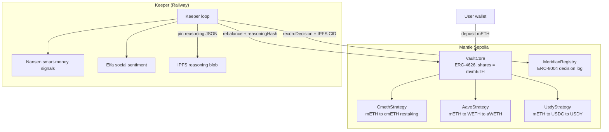

# Meridian

[](https://getfoundry.sh)
[](LICENSE)
[](https://sepolia.mantlescan.xyz)
[](https://meridianprotocol.vercel.app)

**AI-powered ERC-4626 yield vault on Mantle. Deposits mETH and rebalances across cmETH restaking, Aave V3, and USDY T-bills. Every decision is logged on-chain with verifiable AI reasoning stored on IPFS.**

---

## The Problem

Most DeFi users leave funds sitting in one protocol while better yields exist elsewhere. The ones who chase yield manually pay gas and time costs that eat into returns. And when bots do rebalance automatically, there's no way to see why they moved funds or whether the logic actually worked.

---

## Architecture



---

## Live Deployment

Network: **Mantle Sepolia** (chain 5003), RPC: `https://rpc.sepolia.mantle.xyz`

| Contract | Address |
|---|---|
| VaultCore | [0x94fB1E81b912e11fD2718e261EA39810C80c7471](https://sepolia.mantlescan.xyz/address/0x94fB1E81b912e11fD2718e261EA39810C80c7471) |
| CmethStrategy | [0x3a2aa17Fae857007DB1ab8cAEc160C1bEfB9Dca7](https://sepolia.mantlescan.xyz/address/0x3a2aa17Fae857007DB1ab8cAEc160C1bEfB9Dca7) |
| AaveStrategy | [0x441EEAb712DDD88b61642ace0Ae237525512197a](https://sepolia.mantlescan.xyz/address/0x441EEAb712DDD88b61642ace0Ae237525512197a) |
| UsdyStrategy | [0x95389826649dBd891e2aB6a0813EB3336c41345A](https://sepolia.mantlescan.xyz/address/0x95389826649dBd891e2aB6a0813EB3336c41345A) |
| MeridianRegistry | [0x27796e411769ebf9b365e8534bae3a03c5588cad](https://sepolia.mantlescan.xyz/address/0x27796e411769ebf9b365e8534bae3a03c5588cad) |
| MockWETH | [0x849971BAB164D6B8cD7B0916F104c720d5570d19](https://sepolia.mantlescan.xyz/address/0x849971BAB164D6B8cD7B0916F104c720d5570d19) |
| MockCmETH | [0x6431Ba4D08E937adae5EeaBb15797Ddb905c3923](https://sepolia.mantlescan.xyz/address/0x6431Ba4D08E937adae5EeaBb15797Ddb905c3923) |
| MockAavePool | [0xf4b1Dd2DD8eCb168914bFE77Fa11D54594902Dec](https://sepolia.mantlescan.xyz/address/0xf4b1Dd2DD8eCb168914bFE77Fa11D54594902Dec) |
| MockSwapRouter | [0x8FD9C4015d0E4a120DEa40c063c8F8ABe75eA9A8](https://sepolia.mantlescan.xyz/address/0x8FD9C4015d0E4a120DEa40c063c8F8ABe75eA9A8) |
| MockUSDC | [0xd202CaB1bf7A119BC7bA6b0D21Bf453e404AA085](https://sepolia.mantlescan.xyz/address/0xd202CaB1bf7A119BC7bA6b0D21Bf453e404AA085) |
| MockUSDY | [0x245e89818e8e5a93b912287802056dc0f4e71bE3](https://sepolia.mantlescan.xyz/address/0x245e89818e8e5a93b912287802056dc0f4e71bE3) |

ERC-8004 Agent Identity: **#146** at [`0x8004A818BFB912233c491871b3d84c89A494BD9e`](https://sepolia.mantlescan.xyz/address/0x8004A818BFB912233c491871b3d84c89A494BD9e)

Frontend: [meridianprotocol.vercel.app](https://meridianprotocol.vercel.app)

---

## How It Works

**1. Deposit mETH, receive mvmETH shares (ERC-4626)**

Approve mETH and call `deposit()` on VaultCore. You get back `mvmETH` shares priced against `totalAssets()`. Standard ERC-4626, so it composes with anything that understands the interface.

**2. The keeper reads live signals hourly**

Each cycle, the keeper pulls Nansen smart-money net-flows and Elfa social sentiment for mETH and Mantle assets. It also reads on-chain APYs from each strategy. A weighted allocation engine scores each strategy and produces target basis-points.

**3. Rebalance happens within hard safety bounds**

The keeper calls `rebalance(strategies, targetBps, reasoningHash)`. The vault enforces a 70% cap per strategy and a 1-hour cooldown between rebalances. The keeper is a strategist, not a custodian. A fully compromised keeper key can only move funds between whitelisted strategies. It cannot withdraw to an arbitrary address.

**4. Every decision is anchored on-chain with a full reasoning trace**

Before calling `rebalance()`, the keeper pins a reasoning JSON to IPFS: signal inputs, per-strategy scores, rationale, allocation deltas. The IPFS CID is hashed and passed into the transaction. Then `MeridianRegistry.recordDecision()` stores the CID on-chain and updates the keeper's ERC-8004 reputation score. Anyone can pull the CID from chain events and read the exact inputs that drove each rebalance.

---

## Tech Stack

| Layer | Tools |
|---|---|
| Contracts | Solidity 0.8.24, Foundry, OpenZeppelin v5 |
| Keeper | Node.js, TypeScript, viem 2, node-cron, Express |
| Frontend | Next.js 14, wagmi 2, ConnectKit, Recharts, Framer Motion, shadcn/ui |
| Reasoning storage | IPFS via Pinata |
| Network | Mantle Sepolia (chain 5003) |

---

## Quick Start

### Prerequisites

- [Foundry](https://getfoundry.sh) (`curl -L https://foundry.paradigm.xyz | bash`)
- Node.js 20+
- Copy `.env.example` to `.env` and fill in the required keys

### Clone

```bash
git clone https://github.com/0xsamalt/meridian
cd meridian
cp .env.example .env   # fill in KEEPER_PRIVATE_KEY, NANSEN_API_KEY, ELFA_API_KEY, PINATA_JWT
```

### Contracts

```bash
cd packages/contracts
forge install
forge build
forge test
```

### Keeper

```bash
cd packages/keeper
npm install
npm test              # vitest unit suite

npm run dev           # starts keeper HTTP server on :3001
# Trigger a manual cycle:
curl -X POST http://localhost:3001/trigger \
  -H "Authorization: Bearer $ADMIN_SECRET"
```

### Frontend

```bash
cd packages/frontend
npm install
npm run dev           # starts on :3000
```

Connect MetaMask to Mantle Sepolia (chain 5003, RPC `https://rpc.sepolia.mantle.xyz`), then approve and deposit mETH on the deposit page.

---

## Demo

[Demo Video](https://drive.google.com/drive/folders/1hgX0kY2YjQNSTFd-Adye0p742yIq8qeP?usp=sharing)

---

## Hackathon

Built for **Turing Test 2026** (DoraHacks, AI x RWA track).

Most AI yield optimizers are a black box. You deposit, the bot moves funds, and you have no idea whether the logic is any good or whether it will hold up over time. Meridian's keeper has an on-chain identity via ERC-8004 (agent #146). Every rebalance decision is permanently tied to that identity, with the full reasoning verifiable on IPFS.

If the AI makes bad calls repeatedly, its reputation score reflects that. On-chain. Forever. This turns "trust the AI" into "verify the AI."

Three things no other yield aggregator on Mantle does:

- The AI's reasoning is auditable per-transaction, not just summarized in a dashboard.
- The keeper holds an on-chain identity with a reputation score that updates based on realized performance delta vs. a passive-hold benchmark.
- The RWA sleeve (USDY T-bills) is managed by the same AI agent under the same auditable decision framework.

---

## Docs and Links

- [docs/ARCHITECTURE.md](docs/ARCHITECTURE.md): system design, accounting model, address book
- [docs/CONTRACTS.md](docs/CONTRACTS.md): full contract spec with function signatures
- [docs/KEEPER.md](docs/KEEPER.md): allocation engine and signal integration
- [docs/RISKS.md](docs/RISKS.md): threat model and mitigations
- [Live frontend](https://meridianprotocol.vercel.app)
