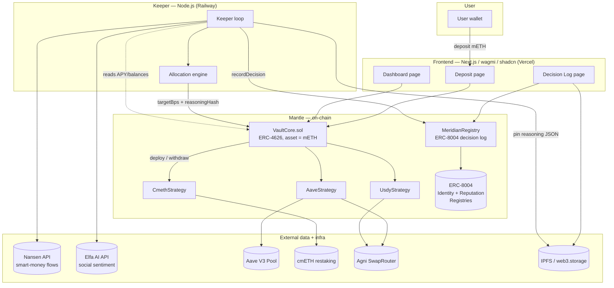

# Meridian — Technical Architecture

> AI-powered yield optimization vault on Mantle. Users deposit **mETH** once; an
> AI keeper rebalances across **cmETH restaking**, **Aave V3 WETH lending**, and a
> **USDY (RWA / T-bill) sleeve**. Every rebalance is logged on-chain with a hash of
> the AI's reasoning. Built as an ERC-4626 vault, with the keeper registered as an
> ERC-8004 agent.

**Hackathon:** Turing Test 2026 (DoraHacks) · AI × RWA track · deadline **June 15, 2026**.

---

## 0. Reality check that shaped this design

The original brief assumed three things that the research **disproved**. The
architecture below is the corrected, *buildable* version. Read this section first —
it explains every non-obvious design choice.

| Brief assumption | Reality (verified) | Design consequence |
|---|---|---|
| "Deposit mETH into Aave" | **mETH is not an Aave V3 reserve on Mantle.** Chaos Labs rejected it (no oracle, ~$1.6M liquidity). Only WETH/USDT0/USDC/USDe/sUSDe/FBTC are listed. | `AaveStrategy` swaps **mETH → WETH** (Agni) then supplies WETH. Peg + slippage risk is now a first-class concern. |
| "Swap mETH → USDY via Agni" | **USDY has no usable DEX liquidity** and mint/redeem is **KYC-gated** (Ondo, non-US only). No testnet deployment. | `UsdyStrategy` is built against a **MockUSDY** on testnet; the swap path is `mETH → USDC → USDY`. Real-USDY = roadmap / grant ask. |
| "First yield aggregator on Mantle" | **False.** Beefy (live) and Circuit Protocol (native) already auto-compound on Mantle. | Positioning wedge = **AI-driven dynamic cross-protocol rebalancing + ERC-8004 agent identity/reputation**, which neither does. |
| cmETH testnet is usable | cmETH testnet address is **stale (Aug 2024)**, network unconfirmed. | `CmethStrategy` runs against real cmETH on the **mainnet fork**; on Sepolia it uses **MockCmETH**. |
| Aave / USDY exist on testnet | Aave V3 = **mainnet only**. USDY = **mainnet only**. | **Dev on a Mantle mainnet fork** (everything real); **Sepolia submission uses mocks** for Aave + USDY + cmETH. |

**Net:** the three yield sources survive, but two of them require a swap hop and the
whole stack is developed on a **forked mainnet** and demoed on **Sepolia with mocks**.

---

## 1. System overview



**One-paragraph data story:** a user deposits mETH into `VaultCore` (ERC-4626) and
receives `mvmETH` shares. Deposited mETH sits in an idle buffer until the keeper
runs. Every cycle the keeper reads on-chain APYs and balances, pulls smart-money
netflows from Nansen and social sentiment from Elfa, computes a target allocation
(basis points across the three strategies), pins a JSON reasoning blob to IPFS, and
calls `rebalance(strategies, targetBps, reasoningHash)`. The vault enforces caps and
a cooldown, moves funds between strategies, and emits `Rebalanced`. The keeper then
calls `MeridianRegistry.recordDecision(...)` which anchors the IPFS hash on-chain and
updates the agent's reputation via ERC-8004. The dashboard reads vault state and the
decision log reconstructs each AI decision from the on-chain hash + IPFS blob.

---

## 2. Component responsibilities

| Component | Responsibility | Trust level |
|---|---|---|
| `VaultCore` | Custody, share accounting (ERC-4626), enforce allocation caps + cooldown, route deposits/withdrawals, pause | Holds all user funds. Highest. |
| `StrategyBase` (abstract) | Common interface + mETH-denominated accounting | — |
| `CmethStrategy` | mETH ↔ cmETH (native restaking) | Holds funds while deployed |
| `AaveStrategy` | mETH ↔ WETH (Agni) ↔ aWETH (Aave supply) | Holds funds while deployed |
| `UsdyStrategy` | mETH ↔ USDC (Agni) ↔ USDY (mock on testnet) | Holds funds while deployed |
| `MeridianRegistry` | ERC-8004 agent registration, on-chain decision log, reputation updates | No funds; integrity of audit trail |
| Keeper (off-chain) | Gather signals, compute allocation, pin reasoning, trigger rebalance | Can only call capped `rebalance` + `recordDecision`. **Cannot withdraw funds.** |
| Frontend | Read state, deposit/withdraw UX, render decision log | Read + user-signed txs only |

**Key invariant:** the keeper is a *strategist*, not a *custodian*. The worst a fully
compromised keeper key can do is move funds **between whitelisted strategies within
hardcoded caps** and write false decision logs. It can never withdraw to an arbitrary
address. See [RISKS.md](./RISKS.md) §1.

---

## 3. Accounting model (the subtle part)

The vault's `asset()` is **mETH**, so `totalAssets()` and every `getBalance()` must be
expressed in **mETH terms** — even though two strategies hold WETH/aWETH and USDY.

```
totalAssets() = idleMeth
              + cmethStrategy.getBalance()   // cmETH → mETH via exchangeRate
              + aaveStrategy.getBalance()    // aWETH → WETH → mETH via quote
              + usdyStrategy.getBalance()    // USDY → USDC → mETH via quote
```

- **cmETH → mETH:** read cmETH/mETH exchange rate from the cmETH contract (rate ≥ 1,
  monotonically increasing). Cleanest conversion, no market price needed.
- **WETH → mETH** and **USDC → mETH:** require a price. We use a **TWAP quote** from the
  Agni pool (not `slot0` spot — manipulation risk) combined with a sanity band against
  a reference rate. mETH ≈ 1.0–1.05 ETH, so WETH↔mETH conversion is near-parity but
  **must not be assumed 1:1**.

> ⚠️ This conversion is the most dangerous line of code in the system. A manipulated
> price inflates/deflates `totalAssets`, which corrupts share price. Mitigations
> (TWAP + deviation bounds + per-block guards) are in [RISKS.md](./RISKS.md) §6.

**Share token:** `mvmETH` (Meridian Vault mETH), 18 decimals, ERC-4626 standard
inflation-attack protection via OZ v5 virtual-shares offset (`_decimalsOffset() = 6`).

---

## 4. Verified address book

> ✅ = verified against authoritative source (official docs / Aave address book /
> verified explorer contract). ⚠️ = exists but caveated. ❌ = do not use as assumed.

### Mantle Mainnet (chain id 5000) — used for the dev fork
| Item | Address | Status |
|---|---|---|
| mETH | `0xcDA86A272531e8640cD7F1a92c01839911B90bb0` | ✅ |
| cmETH | `0xE6829d9a7eE3040e1276Fa75293Bde931859e8fA` | ✅ |
| USDY | `0x5bE26527e817998A7206475496fDE1E68957c5A6` | ⚠️ KYC-gated, no DEX liquidity |
| WETH | `0xdEAddEaDdeadDEadDEADDEAddEADDEAddead1111` | ✅ Aave reserve |
| USDC | `0x09Bc4E0D864854c6aFB6eB9A9cdF58aC190D0dF9` | ✅ |
| USDT0 (Aave-listed) | `0x779Ded0c9e1022225f8E0630b35a9b54bE713736` | ✅ |
| WMNT | `0x78c1b0C915c4FAA5FffA6CAbf0219DA63d7f4cb8` | ✅ |
| Aave V3 Pool | `0x458F293454fE0d67EC0655f3672301301DD51422` | ✅ |
| Aave PoolAddressesProvider | `0xba50Cd2A20f6DA35D788639E581bca8d0B5d4D5f` | ✅ |
| Aave ProtocolDataProvider | `0x487c5c669D9eee6057C44973207101276cf73b68` | ✅ |
| aWETH | `0xeAC30Ed8609F564aE65C809C4bf42dB2fF426D2C` | ✅ |
| Agni SwapRouter (UniV3 fork) | `0x319B69888b0d11cEC22caA5034e25FfFBDc88421` | ✅ |
| Merchant Moe LB Router | `0x013e138EF6008ae5FDFDE29700e3f2Bc61d21E3a` | ✅ backup DEX |
| ERC-8004 Identity Registry | `0x8004A169FB4a3325136EB29fA0ceB6D2e539a432` | ⚠️ verify bytecode on explorer |
| ERC-8004 Reputation Registry | `0x8004BAa17C55a88189AE136b182e5fdA19dE9b63` | ⚠️ verify bytecode on explorer |

### Mantle Sepolia (chain id 5003) — submission target
| Item | Address | Status |
|---|---|---|
| RPC | `https://rpc.sepolia.mantle.xyz` | ✅ |
| Explorer | `https://sepolia.mantlescan.xyz` | ✅ |
| Faucet | `https://faucet.sepolia.mantle.xyz` | ✅ |
| mETH (testnet) | `0x9EF6f9160Ba00B6621e5CB3217BB8b54a92B2828` | ✅ real testnet mETH |
| WETH / Aave / cmETH / USDY | **deploy mocks** | ❌ none exist on Sepolia |
| ERC-8004 Identity (testnet) | `0x8004A818BFB912233c491871b3d84c89A494BD9e` | ⚠️ verify; hackathon Phase I wants testnet identity |
| ERC-8004 Reputation (testnet) | `0x8004B663056A597Dffe9eCcC1965A193B7388713` | ⚠️ verify |

> **Action before any mainnet interaction:** manually eyeball every ✅/⚠️ address on
> `mantlescan.xyz`. Addresses came from docs/address-books/search, not all from a
> rendered explorer page. Treat the ERC-8004 addresses as unconfirmed until you read
> the contract code on the explorer.

---

## 5. Environment matrix

| Concern | Dev (mainnet fork) | Submission (Sepolia) | Future (mainnet) |
|---|---|---|---|
| mETH | real (`0xcDA8…`) | real testnet (`0x9EF6…`) | real |
| cmETH | real | **MockCmETH** | real |
| Aave + WETH | real | **MockAavePool + MockWETH** | real |
| USDY | real token but unswappable → **MockUSDY** | **MockUSDY** | real (needs Ondo KYC integration) |
| Agni swaps | real | **MockSwapRouter** (fixed-rate) | real |
| ERC-8004 | mainnet registry | testnet registry | mainnet registry |
| Nansen/Elfa | live APIs | live APIs (data is chain-agnostic for signals) | live APIs |

Foundry profiles: `[profile.fork]` (`--fork-url $MANTLE_RPC`) and `[profile.sepolia]`.
The same strategy contracts compile for both; only the constructor addresses differ
(injected by the deploy script per environment).

---

## 6. End-to-end data flow

1. **Deposit** — user approves mETH → `vault.deposit(assets, receiver)` → mints `mvmETH`
   shares pro-rata to `totalAssets()`. mETH lands in the **idle buffer**.
2. **Keeper cycle (every 1h, or on signal delta > threshold):**
   a. Read on-chain: each `strategy.getCurrentAPY()`, `strategy.getBalance()`,
      `vault.totalAssets()`.
   b. Read off-chain: Nansen smart-money netflows (chain=`mantle`), Elfa sentiment for
      mETH/MNT/relevant assets.
   c. `AllocationEngine.compute()` → `targetBps[]` per strategy (Σ ≤ 10000).
   d. Build `reasoning.json` (inputs, scores, target, rationale) → pin to IPFS → `cid`.
   e. `reasoningHash = keccak256(cid)` (and store the cid string in the registry).
3. **Execute** — `vault.rebalance(strategies, targetBps, reasoningHash)`:
   - checks `onlyKeeper`, `whenNotPaused`, cooldown elapsed, Σbps ≤ 10000, each
     `bps ≤ maxAllocationBps[strategy]`.
   - computes deltas, calls `strategy.withdraw()` on over-allocated, `strategy.deploy()`
     on under-allocated, settling through the idle buffer.
   - emits `Rebalanced(reasoningHash, strategies, targetBps, totalAssets)`.
4. **Anchor** — keeper calls `MeridianRegistry.recordDecision(reasoningHash, cid,
   perfDeltaBps)` → appends to on-chain history → optional `ReputationRegistry.giveFeedback`.
5. **Display** — Dashboard reads vault/strategy views via wagmi; Decision Log reads
   `MeridianRegistry` events, resolves each `cid` from IPFS, renders the reasoning.
6. **Withdraw** — `vault.withdraw/redeem` pulls from idle first, then unwinds strategies
   in a configured priority order, converting back to mETH; `nonReentrant`.

---

## 7. Deployment architecture

### 7.1 Foundry deploy order (per environment)
```
1. (Sepolia only) deploy mocks: MockWETH, MockCmETH(mETH), MockUSDY(USDC),
   MockUSDC, MockAavePool, MockSwapRouter — and seed them with liquidity/rates.
2. VaultCore(asset = mETH, admin = multisig, keeper = KEEPER_ADDR, guardian = GUARDIAN)
3. CmethStrategy(vault, mETH, cmETH)
4. AaveStrategy(vault, mETH, WETH, aavePool, dataProvider, agniRouter)
5. UsdyStrategy(vault, mETH, USDC, USDY, agniRouter)
6. MeridianRegistry(vault, erc8004Identity, erc8004Reputation, keeper)
7. vault.addStrategy(cmeth);  vault.setMaxAllocation(cmeth, 6000)
   vault.addStrategy(aave);   vault.setMaxAllocation(aave, 6000)
   vault.addStrategy(usdy);   vault.setMaxAllocation(usdy, 5000)
8. registry.registerAgent(agentURI)   // ERC-8004 register()
9. Verify all contracts on mantlescan / sepolia.mantlescan
```

### 7.2 Environment variables
```bash
# --- chain ---
MANTLE_RPC=https://rpc.mantle.xyz
MANTLE_SEPOLIA_RPC=https://rpc.sepolia.mantle.xyz
CHAIN_ID=5003                         # 5000 for mainnet
MANTLESCAN_API_KEY=...                # for forge verify

# --- deployer / keeper (NEVER commit) ---
DEPLOYER_PRIVATE_KEY=...              # deploys, then transfers admin to multisig
KEEPER_PRIVATE_KEY=...                # keeper hot wallet, capped powers only
GUARDIAN_MULTISIG=0x...              # pause authority
ADMIN_MULTISIG=0x...                 # owner / strategy whitelist

# --- contracts (filled post-deploy) ---
VAULT_ADDRESS=0x...
REGISTRY_ADDRESS=0x...
CMETH_STRATEGY=0x...
AAVE_STRATEGY=0x...
USDY_STRATEGY=0x...

# --- data APIs ---
NANSEN_API_KEY=...
ELFA_API_KEY=...
WEB3_STORAGE_TOKEN=...                # IPFS pinning

# --- keeper config ---
REBALANCE_INTERVAL_SECONDS=3600
MIN_REBALANCE_DELTA_BPS=300           # skip if no strategy moves >3%
COOLDOWN_SECONDS=3600                 # mirrors on-chain cooldown
```

### 7.3 Hosting
- **Contracts:** Foundry → Sepolia (submission) + mainnet-fork (dev/CI).
- **Keeper:** **Railway** (simplest: cron-style worker, env secrets, logs, autoredeploy).
  Render/VPS acceptable. Use a managed secret store for `KEEPER_PRIVATE_KEY`; never bake
  into the image. Future: migrate trigger to **Gelato/Chainlink Automation** so no hot
  key holds even capped powers (see RISKS §1).
- **Frontend:** **Vercel** (Next.js App Router). Env: `NEXT_PUBLIC_*` contract addresses,
  RPC, WalletConnect project id.
- **IPFS:** web3.storage (or Pinata) for reasoning blobs.

### 7.4 Contract verification
```bash
forge verify-contract --chain-id 5003 \
  --verifier blockscout \
  --verifier-url https://sepolia.mantlescan.xyz/api \
  $ADDR src/VaultCore.sol:VaultCore
```

---

## 8. Why this wins the AI × RWA track

- **Uses the real native stack:** mETH (deposit), cmETH (restaking), Aave V3 (live
  Mantle market), USDY (RWA narrative). Maximum "Mantle ecosystem fit" — the stated
  Grand Champion criterion.
- **The AI is verifiable, not decorative:** every decision is an on-chain hash → IPFS
  reasoning, scored against a passive-hold benchmark. This is literally the "Turing
  Test" framing — can the AI beat the human's buy-and-hold?
- **ERC-8004 native:** the keeper is a registered agent with an on-chain reputation
  that updates with realized performance — exactly the autonomous-agent economy Mantle
  is pushing, and catnip for judges from Virtuals / Allora.
- **Honest differentiation:** not "first aggregator" (Beefy/Circuit exist) but "first
  *AI-driven, cross-protocol, reasoning-transparent* optimizer with agent identity."

See [CONTRACTS.md](./CONTRACTS.md) for full signatures, [KEEPER.md](./KEEPER.md) for the
allocation engine, and [RISKS.md](./RISKS.md) for the threat model.
