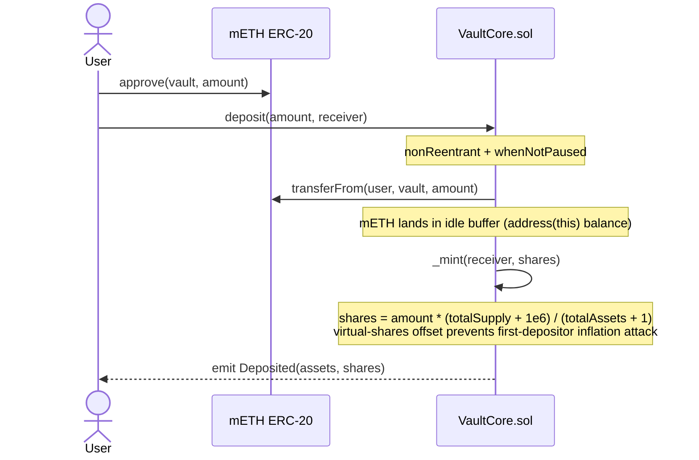
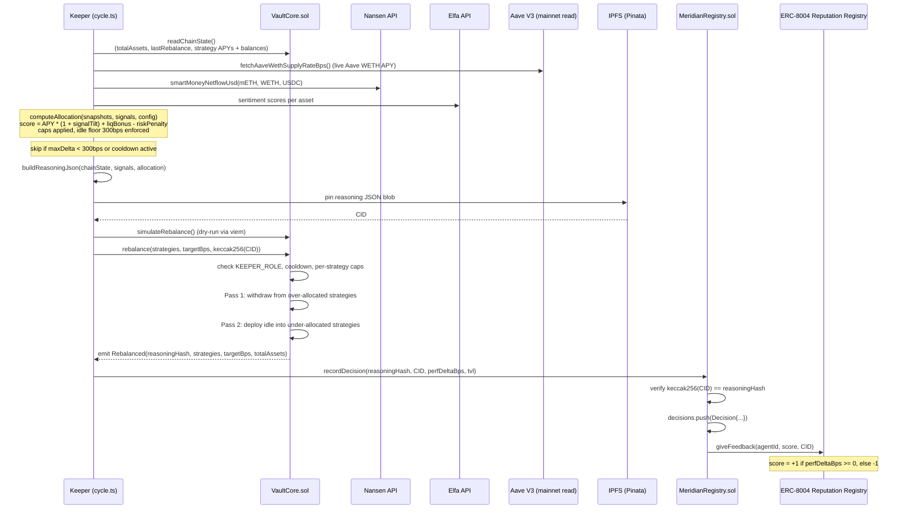

# Meridian Technical Architecture

AI-powered yield optimization vault on Mantle. Users deposit mETH once. An off-chain AI keeper rebalances across cmETH restaking, Aave V3 WETH lending, and a USDY T-bill sleeve. Every rebalance is logged on-chain with a hash of the keeper's full reasoning, stored on IPFS. The keeper is a registered ERC-8004 agent with an on-chain reputation that degrades if its decisions underperform.

**Hackathon:** Turing Test 2026 (DoraHacks), AI x RWA track.

---

## Table of Contents

1. [Deposit Flow](#1-deposit-flow)
2. [Keeper Cycle](#2-keeper-cycle)
3. [Security Model](#3-security-model)
4. [ERC-8004 Agent Identity and Reputation](#4-erc-8004-agent-identity-and-reputation)
5. [Gas Reference](#5-gas-reference)
6. [Design Decisions](#6-design-decisions)

---

## 1. Deposit Flow

The deposit path is stateless from the user's perspective: approve mETH, call `deposit()`, receive `mvmETH` shares. The vault does not automatically deploy to strategies. Deposits accumulate in the idle buffer until the next keeper rebalance.



**Share pricing.** `totalAssets()` sums the idle mETH balance plus each strategy's `getBalance()`. Each strategy returns its value denominated in mETH (cmETH uses `convertToAssets()`; WETH and USDC positions use a TWAP quote back to mETH). A 6-decimal virtual-shares offset (`_decimalsOffset() = 6`) per OZ v5 prevents the standard inflation attack.

**Withdrawal.** `withdraw()` and `redeem()` are always available, even when the vault is paused. Funds come from the idle buffer first. If the buffer is short, the vault unwinds strategies in order until the shortfall is covered (`_ensureLiquidity`). This means a withdrawal may trigger swap hops (mETH back from WETH or USDC) and incurs more gas than a pure idle withdrawal.

---

## 2. Keeper Cycle

The keeper runs on a cron schedule (`REBALANCE_INTERVAL_SECONDS`, default 1 hour) and can also be triggered manually via `POST /trigger`. Each cycle follows this sequence:



**Allocation engine (`engine/allocate.ts`).** Each strategy gets a raw score:

```
score = (apyBps / 100) * (1 + signalTilt) + liquidityBonus - (riskWeight * protocolRiskScore)
```

Where `signalTilt = signalWeight * (0.7 * normalizedNetflow + 0.3 * sentiment)`, clamped to `[-maxTilt, maxTilt]`. Default weights: `signalWeight = 0.25`, `maxTilt = 0.25`. Scores are normalized to basis points, per-strategy caps are applied, and a 300bps idle floor is enforced last. If both Nansen and Elfa data are stale, the engine falls back to `defensiveAllocation` (equal-weight, reduced exposure).

**Skip conditions.** A cycle does nothing if the on-chain cooldown has not elapsed or if the maximum allocation delta is below `MIN_REBALANCE_DELTA_BPS` (300bps default). Both checks happen before any IPFS pin or transaction is submitted.

**IPFS reasoning blob.** The pinned JSON includes: strategy APYs and current balances, Nansen netflow values, Elfa sentiment scores, per-strategy scores, target basis-points, rationale string, and the performance delta vs. the passive-hold benchmark. This is the data a third party needs to reconstruct why funds moved.

---

## 3. Security Model

### Invariants

| Invariant | Enforcement | Code Reference |
|---|---|---|
| Max 70% allocation to any single strategy | `rebalance()` checks `targetBps[i] <= maxAllocationBps[strat]`; `addStrategy()` rejects `maxBps > maxSingleAllocationBps (7000)` | `VaultCore.sol:129-133`, `VaultCore.sol:173` |
| 1-hour cooldown between rebalances | `block.timestamp < lastRebalance + cooldown` reverts with `CooldownActive` | `VaultCore.sol:127-128` |
| Total allocation cannot exceed 10,000bps | Sum of `targetBps` checked before any fund movement | `VaultCore.sol:130-136` |
| TWAP-only swap pricing, never `slot0` | All price quotes go through `PriceLib.twapQuote()` using a 30-minute window; deviations `>200bps` from reference revert | `PriceLib.sol:42-57`, `AaveStrategy.sol:104-107`, `UsdyStrategy.sol:94-96` |
| `nonReentrant` on all vault and strategy entry points | `VaultCore.deposit/mint/withdraw/redeem/rebalance` inherit OZ `ReentrancyGuard`; `StrategyBase.deploy/withdraw/withdrawAll` apply the same guard before delegating to children | `VaultCore.sol:72-163`, `StrategyBase.sol:35-44` |
| Keeper can call `rebalance()` and `recordDecision()` only; cannot withdraw to arbitrary address | `KEEPER_ROLE` is only granted `rebalance()` access; `withdraw/redeem` have no role restriction and route funds only to the `receiver` parameter (caller must own shares) | `VaultCore.sol:19,122`, `MeridianRegistry.sol:11,54` |
| Strategies cannot send funds anywhere except back to the vault | `_withdraw/_withdrawAll` in every strategy call `IERC20(asset).safeTransfer(vault, ...)` as the final step; the keeper never touches token transfers directly | `AaveStrategy.sol:54-55`, `UsdyStrategy.sol:49-50`, `CmethStrategy.sol:28` |
| Guardian can pause deposits and new rebalances instantly | `emergencyPause(pullFunds)` calls `_pause()` and optionally drains all strategies to idle via `try/catch` per strategy so one failure cannot block the rest | `VaultCore.sol:208-216` |
| Withdrawal is never paused | `withdraw()` and `redeem()` do not carry `whenNotPaused` | `VaultCore.sol:87,95` |
| Unpausing requires admin multisig, not the guardian | Asymmetric: guardian can pause in one tx, unpause requires `DEFAULT_ADMIN_ROLE` | `VaultCore.sol:219-220` |
| Strategy principal token cannot be swept by owner | `StrategyBase.sweep()` rejects calls where `token == asset` | `StrategyBase.sol:74-77` |

### Role matrix

| Role | Holder | Allowed actions |
|---|---|---|
| `DEFAULT_ADMIN_ROLE` | Admin multisig | Add/remove strategies, set allocation caps, unpause, set cooldown |
| `KEEPER_ROLE` | Keeper EOA | `rebalance()` on vault, `recordDecision()` on registry |
| `GUARDIAN_ROLE` | Guardian EOA (same as keeper on testnet) | `emergencyPause()` |

On mainnet, guardian and keeper should be separate keys. The keeper should eventually be a Gelato or Chainlink Automation job so no hot key holds even the capped powers.

---

## 4. ERC-8004 Agent Identity and Reputation

ERC-8004 is Mantle's standard for registering autonomous agents on-chain. It has two contracts: an Identity Registry (ERC-721, one NFT per agent) and a Reputation Registry (feedback linked to each NFT).

### How the keeper is registered

`MeridianRegistry.registerAgent(agentURI)` calls `IERC8004Identity.register(agentURI)`, which mints an NFT to `MeridianRegistry` and returns an `agentId`. On testnet this is agent `#146`. The `agentURI` points to a JSON metadata blob describing the keeper's purpose, the vault it manages, and where to find its decision log.

### How reputation is computed

After each successful rebalance, `recordDecision(reasoningHash, cid, perfDeltaBps, tvl)` does two things:

1. Appends a `Decision` struct to the on-chain log. The struct holds the IPFS CID, the `keccak256(CID)` hash (so the CID cannot be swapped without breaking the hash), the performance delta vs. the passive-hold baseline, and a TVL snapshot.

2. Calls `reputation.giveFeedback(agentId, score, cid)` where `score = +1` if `perfDeltaBps >= 0` and `-1` otherwise. This links one feedback record to the agent's NFT inside the ERC-8004 Reputation Registry.

The performance delta (`perfDeltaBps`) is the change in vault TVL in mETH terms since the last decision, compared to what the value would have been under passive hold. A positive delta means the keeper grew the vault above a do-nothing baseline. A negative delta means it lost ground. The computation lives in `engine/benchmark.ts`.

### What this prevents

Without on-chain identity, an AI bot that makes bad rebalancing decisions can just be redeployed with a fresh address and a clean slate. With ERC-8004, the keeper's full decision history is attached to a permanent NFT. A series of negative feedback records is visible to anyone reading the Reputation Registry. It cannot be erased and does not require trusting any dashboard or off-chain service.

This is particularly relevant for an AI managing real funds. Humans auditing the vault can look at the keeper's reputation score and decision log to answer: how many rebalances has this agent made, what fraction improved the vault's position, and what were the stated reasons for each decision? All of this is queryable on-chain, down to the IPFS CID for each reasoning blob.

### Tamper-evidence

The `recordDecision()` function verifies `keccak256(bytes(cid)) == reasoningHash` before writing. The same hash is passed into `VaultCore.rebalance()` and emitted in the `Rebalanced` event. This creates a three-way link: the on-chain event (reasoningHash), the registry record (CID + hash), and the IPFS blob. Changing the reasoning after the fact would require changing the CID, which invalidates the hash in the on-chain log.

---

## 5. Gas Reference

Numbers from `forge test --gas-report` on Mantle Sepolia testnet mocks. The `rebalance` max scales with how many strategies need fund movement; the minimum (37,758) applies when all strategies are already at target.

| Operation | Contract | Avg gas | Max gas | Notes |
|---|---|---|---|---|
| `deposit` | `VaultCore` | 119,653 | 154,668 | Max is first deposit (storage slot init). Subsequent deposits are ~125k. |
| `withdraw` | `VaultCore` | 224,685 | 374,893 | Includes strategy unwind. Idle-only path (`redeem` with buffer) is ~62k. |
| `redeem` (idle) | `VaultCore` | 61,897 | 61,897 | No strategy unwinding needed. |
| `rebalance` | `VaultCore` | 296,596 | 566,368 | Max is 3-strategy cross-rebalance with full swap hops. |
| `recordDecision` | `MeridianRegistry` | 140,205 | 168,032 | Includes IPFS CID string storage and ERC-8004 feedback call. |

Mantle gas prices are much lower than Ethereum mainnet. A typical rebalance cycle (one `rebalance` + one `recordDecision`) costs roughly 436k gas. At Mantle's typical gas price (~0.02 gwei), that is about $0.03 USD per cycle.

All numbers are from test suite execution (`forge test --gas-report`, Solidity 0.8.24, optimizer runs 200). They will differ slightly on mainnet due to cold vs. warm storage slots.

---

## 6. Design Decisions

A few non-obvious choices worth explaining for reviewers.

**Why mETH is not deposited directly into Aave.** mETH is not an Aave V3 reserve on Mantle. Only WETH, USDT0, USDC, USDe, sUSDe, and FBTC are listed. `AaveStrategy` works around this by swapping mETH to WETH (Agni router) before supplying. This adds slippage risk on both sides, which is why TWAP deviation guards exist.

**Why USDY uses mocks on testnet.** USDY has no DEX liquidity on Mantle and its mint/redeem is KYC-gated through Ondo (non-US only). The real USDY path is roadmap; on testnet `MockUSDY` gives the full code path a workout with a fixed exchange rate.

**Why cmETH uses a mock on testnet.** The cmETH testnet contract address from August 2024 is stale and the network is unconfirmed. `CmethStrategy` tests against a real cmETH on a Mantle mainnet fork; on Sepolia it uses `MockCmETH` which implements the same `deposit/redeem/convertToAssets` interface.

**Why the idle buffer exists.** The vault always keeps at least 300bps of TVL as idle mETH (`idleFloorBps`). This means small withdrawals do not require strategy unwinds and avoids gas-heavy swap hops for everyday redemptions. The allocation engine enforces this floor after scoring.

**Why pricing uses a library, not inline code.** `PriceLib.twapQuote()` is a single chokepoint. Testnet deploys inject mock prices via `setMockPrice()`. Production deploys will call the Agni pool's `observe()` with a 30-minute TWAP window and cross-check against a reference feed. Having one function for all price lookups means there is exactly one place to audit and one place where `slot0` could accidentally slip in. It cannot.

**Why `emergencyPause` uses `try/catch` per strategy.** If one strategy's `withdrawAll()` reverts (e.g., external protocol is also paused), the guardian's pause should not get stuck. Each strategy unwind is wrapped independently so a single failure does not block the others from returning funds to the idle buffer.
